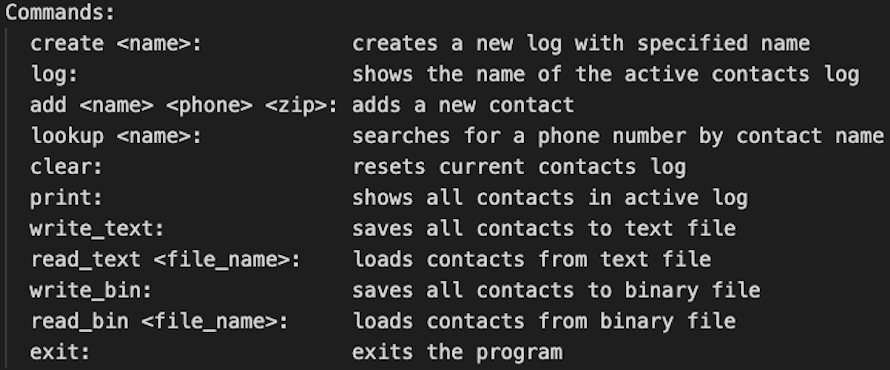
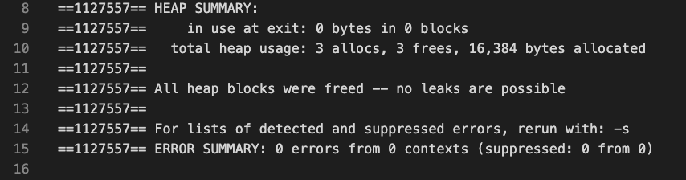
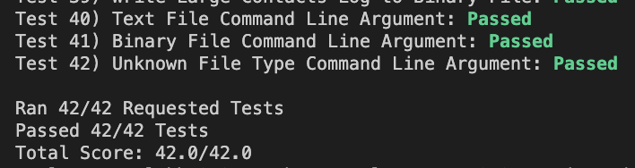
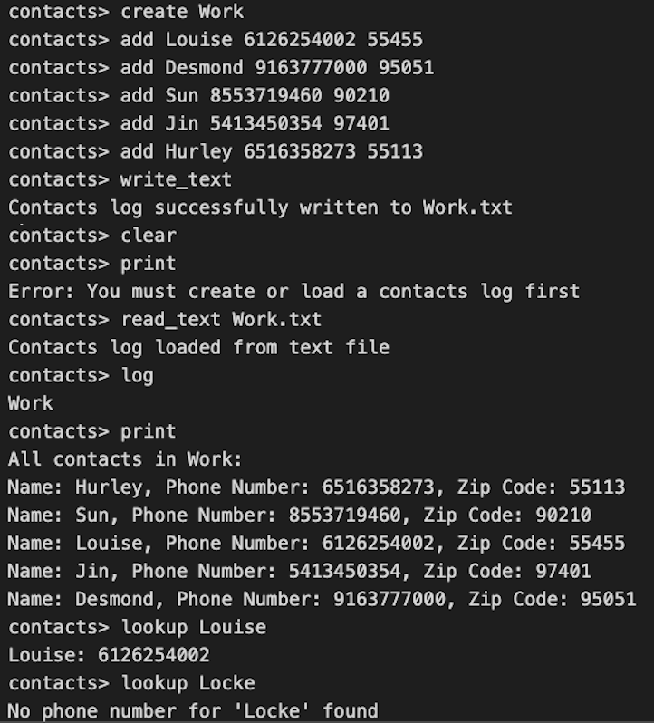

# Contact Hash Table



Created a contact log system with 11 functions. Create a log of contacts, look up names, clear the log, print contact names, plus read and write from .txt and .bin files. As well as printing error messages for anything a user might input incorrectly, like non-existent contact names or not having a contact log created. 

Using hash table functions made it very useful in handling large data sets of employees as well as their numbers. We even tested this with edge cases to prove it would be correct. This case below had over 1500 lines of contacts in the fictional ‘University’ as well as 500 lines of testing the lookup/add functions. 



I also used Valgrind to make sure everything I allocated memory using malloc () for I also freed at the end. Ensuring 100% there were no memory leaks.

Each time a new item is added to a bucket in the hash table, it is appended to the end of the bucket's linked list.

## <a href="https://www.youtube.com/watch?v=UNz9k9E9IWM"> Demo Video on YouTube </a>





## Setup

If you want to play around with Contact Hash Table, feel free to clone my repo. To start, please enter the following commands on your terminal:

```
git clone https://github.com/CamNagle24/Contact_Hash_Table
make
```

At this point, you are free to type in whatever sequence of commands you like once you are cd'd into the proj1-code folder.

To get into the Contact Log System type

```
./contacts_main
```

Or if you want to run all 42 tests including reading/writing to binary files:

```
make test
```
